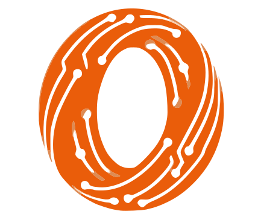

  <picture>
    <source srcset="./assets/cds-logo-white.png" media="(prefers-color-scheme: dark)">
    
  </picture>

# Cipta Dua Saudara (CDS)

  <a href="#english">English</a> · <a href="#bahasa-indonesia">Bahasa Indonesia</a>

---

## English

CDS builds digital products, business systems, and open source tools from Indonesia. Main site: [ciptadusa.com](https://ciptadusa.com).

We focus on two public divisions:

<table>
  <tr>
    <td width="50%" align="center">
      
      <h3>Zetta CRM</h3>
      
Self-hosted, local-first CRM backend for AI agents. Manage contacts, email, inbox sync, campaigns, scheduling, analytics, and MCP operations inside your own stack.

      
<a href="https://zettacrm.com">zettacrm.com</a>

    </td>
    <td width="50%" align="center">
      
      <h3>Open Source Divisions</h3>
      
CDS Open Source home for public tools, experiments, and community-ready engineering work.

      
<a href="https://open.ciptadusa.com">open.ciptadusa.com</a>

    </td>
  </tr>
</table>

### About Us

Cipta Dua Saudara (CDS) partners with companies to design, build, and improve software. We combine product strategy, web development, app development, automation, and IT consulting to help teams ship practical technology with long-term value.

### Products

<table>
  <tr>
    <td width="100%" align="center">
      
      <h3>📦 SOngkir</h3>
      
Shopify plugin for Indonesian domestic shipping rate checks. Supports JNE, J&amp;T, SiCepat, AnterAja, and other couriers.

      

        
        
      

    </td>
  </tr>
</table>

### Services

<table>
  <tr>
    <td width="33%">
      <h3>🚀 App Development</h3>
      
Custom mobile and web applications tailored to business needs, built for usability, robust functionality, and seamless user experience.

    </td>
    <td width="33%">
      <h3>💻 Web Development</h3>
      
Responsive, high-performance websites that represent your brand and help audiences understand, trust, and contact your business.

    </td>
    <td width="33%">
      <h3>📊 IT Consulting</h3>
      
Practical IT consulting to improve infrastructure, streamline operations, and support business growth with fit-for-purpose technology.

    </td>
  </tr>
</table>

### Contact

For more information about our services and solutions:

🌐 [ciptadusa.com](https://ciptadusa.com)  
📧 [info@ciptadusa.com](mailto:info@ciptadusa.com)

---

## Bahasa Indonesia

CDS membangun produk digital, sistem bisnis, dan tools open source dari Indonesia. Situs utama: [ciptadusa.com](https://ciptadusa.com).

Kami berfokus pada dua divisi publik:

<table>
  <tr>
    <td width="50%" align="center">
      
      <h3>Zetta CRM</h3>
      
Backend CRM self-hosted dan local-first untuk AI agents. Kelola kontak, email, sinkronisasi inbox, campaign, scheduling, analytics, dan operasi MCP di dalam stack Anda sendiri.

      
<a href="https://zettacrm.com">zettacrm.com</a>

    </td>
    <td width="50%" align="center">
      
      <h3>Open Source Divisions</h3>
      
Rumah open source CDS untuk public tools, eksperimen, dan karya engineering yang siap digunakan komunitas.

      
<a href="https://open.ciptadusa.com">open.ciptadusa.com</a>

    </td>
  </tr>
</table>

### Tentang Kami

Cipta Dua Saudara (CDS) membantu perusahaan merancang, membangun, dan meningkatkan software. Kami menggabungkan strategi produk, web development, app development, automation, dan IT consulting untuk membantu tim mengirim teknologi praktis dengan nilai jangka panjang.

### Produk

<table>
  <tr>
    <td width="100%" align="center">
      
      <h3>📦 SOngkir</h3>
      
Plugin Shopify untuk cek ongkos kirim domestik Indonesia. Mendukung JNE, J&amp;T, SiCepat, AnterAja, dan kurir lainnya.

      

        
        
      

    </td>
  </tr>
</table>

### Layanan

<table>
  <tr>
    <td width="33%">
      <h3>🚀 App Development</h3>
      
Aplikasi mobile dan web custom sesuai kebutuhan bisnis, dibangun untuk kemudahan penggunaan, fungsi yang kuat, dan pengalaman pengguna yang mulus.

    </td>
    <td width="33%">
      <h3>💻 Web Development</h3>
      
Website responsif dan berperforma tinggi untuk merepresentasikan brand serta membantu audiens memahami, percaya, dan menghubungi bisnis Anda.

    </td>
    <td width="33%">
      <h3>📊 IT Consulting</h3>
      
Konsultasi IT praktis untuk memperbaiki infrastruktur, merapikan operasional, dan mendukung pertumbuhan bisnis dengan teknologi yang tepat guna.

    </td>
  </tr>
</table>

### Kontak

Untuk informasi lebih lanjut tentang layanan dan solusi kami:

🌐 [ciptadusa.com](https://ciptadusa.com)  
📧 [info@ciptadusa.com](mailto:info@ciptadusa.com)

